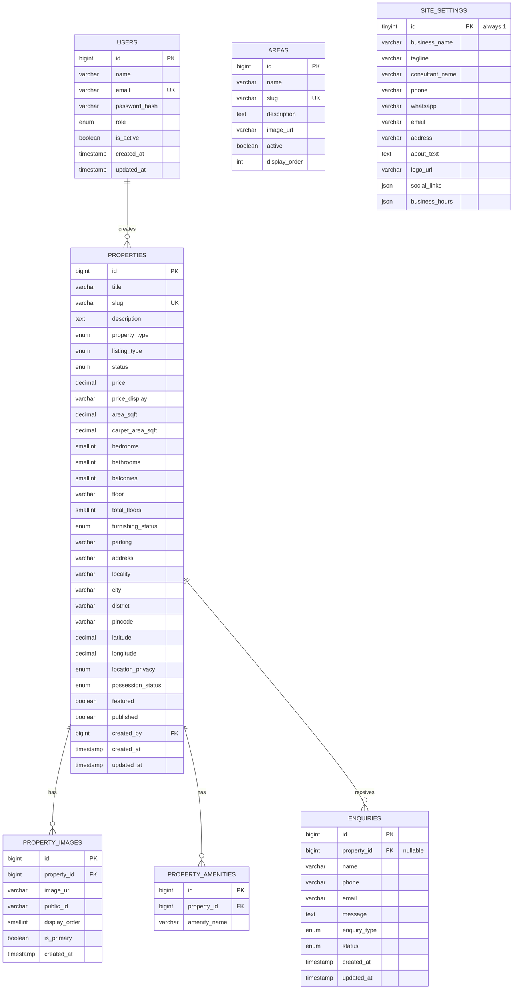

# HappyHouse — Entity Relationship Diagram

## Design notes

- **`areas` and `site_settings` are intentionally disconnected** from `properties` by foreign key. `areas` is a curated list for the "Areas We Serve" UI (spec §25); property `locality` is free text so listings aren't blocked on an area existing first. If strict linkage is wanted later, add `area_id` to `properties` as a nullable FK.
- **`site_settings` is a single-row table** (`id` pinned to `1` via CHECK constraint) — there is exactly one business configuration, matching spec §33 ("public site automatically reflects changes").
- **`property_images.public_id`** stores the Cloudinary (or equivalent) asset identifier separately from the served URL, so images can be deleted from storage — not just unlinked in the DB — when removed.
- **`enquiries.property_id` is nullable** to support general enquiries from `/contact` that aren't tied to a specific listing (spec §28 vs §29).
- **Indexes**: `idx_properties_search` is a composite covering the most common filter combination (published + listing_type + property_type + locality + price) for the search/filter/sort flow in spec §22–24. A FULLTEXT index covers free-text search across title/description/locality.
- **No images stored in MySQL** — `image_url`/`public_id` only, per spec §52 ("Do NOT store images inside MySQL").
